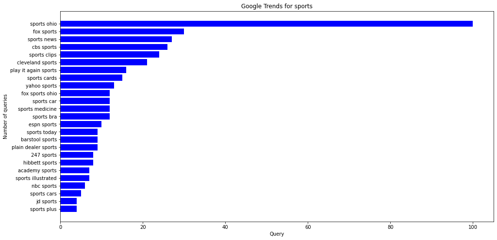
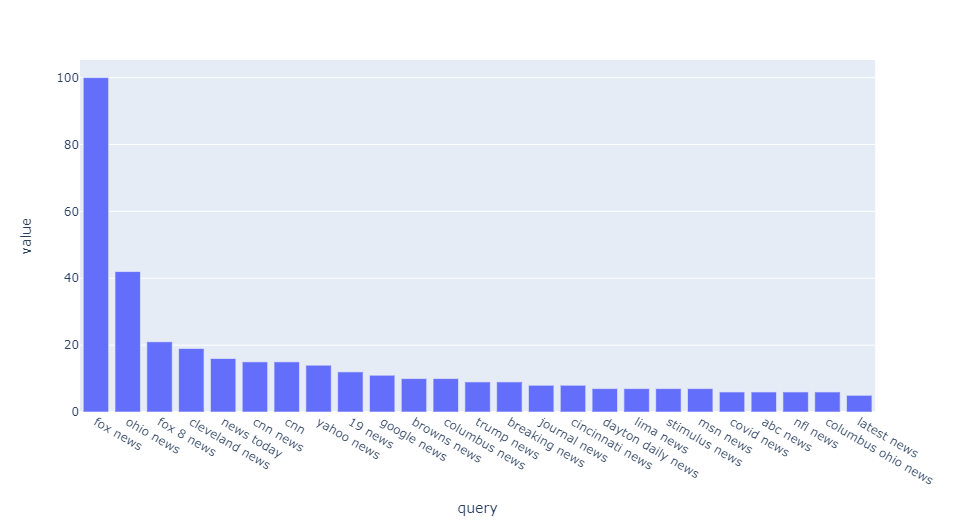
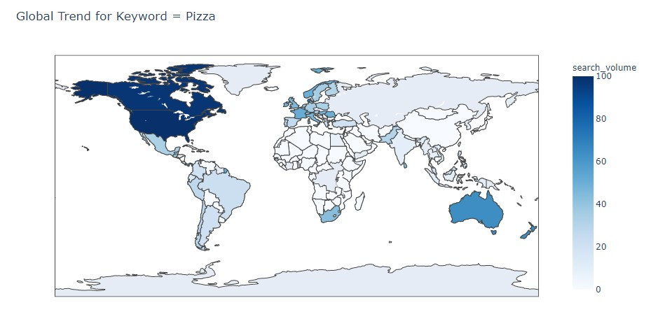
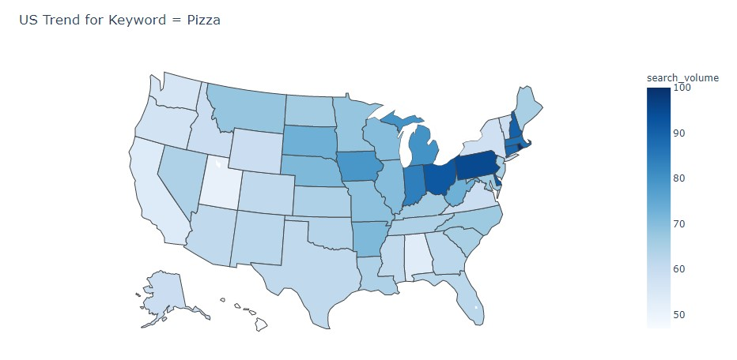

# Google Trends with Pytrends

In this repo I will show how to build a script in Python, using Pytrends to effectively automate data collection from Google Trends. Pytrends help you analyze the trend you are interested in effortlessly. For example, if you want to see the trends in your area or region ex. 'sport' or 'news', you could see some interesting insights like below.

#### Top trends in Ohio State - Keyword = "sport"

#### Top trends in Ohio State - Keyword = "news"

#### Global Trend for Keyword = Pizza

#### US Trend for Keyword = Pizza

### For more info about how to install Pytrends and its documentation visit: https://pypi.org/project/pytrends/

